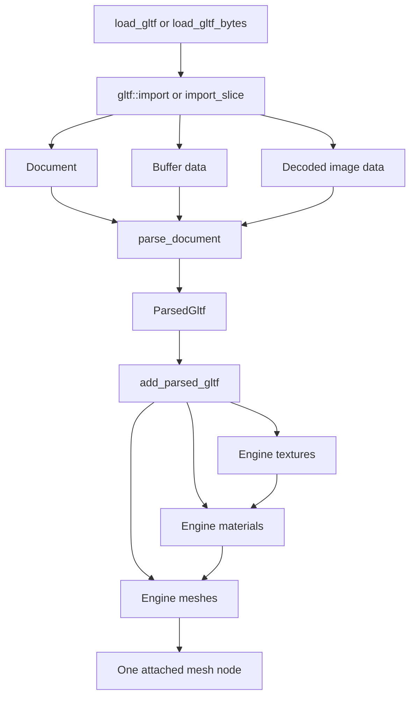

# glTF Parser

The parser in [`src/parser.rs`](src/parser.rs) loads a glTF 2.0 `.gltf` or `.glb` asset and converts it into the engine's existing `Texture`, `Material`, `Mesh` and `Node3D` resources.

It is an importer, not a persistent glTF representation. glTF objects and indices are used while loading, then replaced by engine resources and handles.

## Entry points

```rust
engine.load_gltf(path, parent)?;
engine.load_gltf_bytes(bytes, parent)?;
```

`load_gltf` supports external files referenced by a `.gltf` document. `load_gltf_bytes` is intended for self-contained GLB data or glTF data with embedded resources.

Both methods return the `Node3DHandle` of one new mesh node attached below `parent`.

## Loading flow



There are three stages.

### 1. Import

The `gltf` crate reads the container and returns:

| Value               | Contains                                                    |
| ------------------- | ----------------------------------------------------------- |
| `Document`          | Scenes, nodes, meshes, primitives, materials and references |
| `Vec<buffer::Data>` | Decoded vertex, index and other buffer bytes                |
| `Vec<image::Data>`  | Decoded image pixels                                        |

No engine resources exist yet.

### 2. Parse

`parse_document` converts glTF data into temporary CPU-side structures:

| Type              | Purpose                                                    |
| ----------------- | ---------------------------------------------------------- |
| `ParsedGltf`      | All parsed materials, primitives and images                |
| `ParsedMaterial`  | Core glTF metallic-roughness values and texture references |
| `ParsedTexture`   | The source image index and requested UV set                |
| `ParsedPrimitive` | Engine vertices, indices and optional material index       |

`parse_node` recursively visits the selected scene. It accumulates parent transforms and passes each primitive's world transform to `parse_primitive`.

`parse_primitive`:

- Accepts triangle-list primitives only.
- Reads positions, indices, normals and `TEXCOORD_0`.
- Bakes the glTF node's world transform into positions and normals.
- Reverses triangle winding when a transform contains a reflection.
- Generates smooth normals when `NORMAL` is absent.
- Supplies zero UVs when `TEXCOORD_0` is absent.
- Rejects primitives which exceed the engine's `u16` index range.

The original glTF node hierarchy is therefore flattened. Transforms are baked into geometry rather than reproduced as engine nodes.

### 3. Create engine resources

`add_parsed_gltf` converts temporary parsed data into resources owned by `Engine`:

1. Referenced base-colour images become engine `Texture` resources.
2. Each glTF material becomes an engine `Material`.
3. Each glTF primitive becomes one engine `Mesh` with its material handle.
4. All imported meshes are attached to one new mesh node below `parent`.

A primitive without a glTF material uses `Engine::default_material()`.

## Images, textures and handles

These overlapping terms refer to different things:

| Term                        | Meaning                                                              |
| --------------------------- | -------------------------------------------------------------------- |
| glTF image                  | Pixel data stored externally, in a data URI, or in a GLB buffer view |
| glTF texture                | A reference to a glTF image, sampler and UV set                      |
| `ParsedTexture.image_index` | Temporary index into the images returned by `gltf::import`           |
| engine `Texture`            | Resource containing a `wgpu::Texture`, view and sampler              |
| `TextureHandle`             | Engine slotmap key used to find a `Texture` in `Engine.textures`     |

`load_material_texture` performs the transition from a glTF image index to an engine `TextureHandle`:

```text
glTF image index
    -> decoded DynamicImage
    -> Engine::create_texture_from_image
    -> Texture inserted into Engine.textures
    -> TextureHandle returned
```

There is currently no texture deduplication. If several materials reference the same glTF image, each creates its own engine `Texture`. This keeps the loading path simple.

The image conversion helpers preserve the decoded glTF pixel format while constructing an `image::DynamicImage`. `Texture::from_image` then converts it to RGBA bytes for upload.

## Material support

The parser reads all core glTF metallic-roughness properties, but only properties supported by the current `Material` API are applied.

| glTF property                  | Parsed |   Applied    |
| ------------------------------ | :----: | :----------: |
| Base colour factor             |  Yes   |     Yes      |
| Base colour texture            |  Yes   | Yes, as sRGB |
| Metallic factor                |  Yes   |   Not yet    |
| Roughness factor               |  Yes   |   Not yet    |
| Metallic-roughness texture     |  Yes   |   Not yet    |
| Normal texture and scale       |  Yes   |   Not yet    |
| Occlusion texture and strength |  Yes   |   Not yet    |
| Emissive factor and texture    |  Yes   |   Not yet    |
| Alpha mode and cutoff          |  Yes   |   Not yet    |
| Double-sided                   |  Yes   |   Not yet    |

Unsupported values are retained in `ParsedMaterial` and collected in `_material_stubs` at the engine-resource boundary. This marks where each future `Material` setter should be called without pretending the renderer already supports it.

Texture colour spaces must be selected by usage:

| Texture slot       | GPU interpretation |
| ------------------ | ------------------ |
| Base colour        | sRGB               |
| Emissive           | sRGB               |
| Metallic-roughness | Linear             |
| Normal             | Linear             |
| Occlusion          | Linear             |

## Current limitations

- Only the default scene, or the first scene when no default exists, is loaded.
- Only triangle-list primitives are supported.
- Indices and vertex counts are limited by the engine's `u16` index buffers.
- The scene hierarchy is flattened and transforms are baked into geometry.
- Only `TEXCOORD_0` is stored by `Vertex`. Other requested UV sets produce a warning and still use UV set 0 at render time.
- Tangents, vertex colours, skins, morph targets, animations and cameras are not imported.
- glTF sampler settings are not imported. Engine textures use the sampler created by `Texture::from_image`.
- Textures are not deduplicated.
- Only base-colour material properties currently affect rendering.

## Extending material support

For each new material property:

1. Add or complete the corresponding `Material` setter.
2. Apply the parsed value in `add_parsed_gltf`.
3. For a texture slot, call `load_material_texture` with the correct sRGB or linear format.
4. Remove that property from `_material_stubs`.
5. Update the WGSL shader and render state where required.

Factors only require a uniform update. Texture changes require the material bind group to be rebuilt. Alpha mode and double-sided rendering also require pipeline or draw-state support, not just uniform fields.
